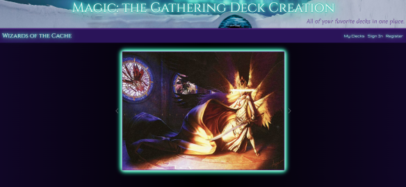
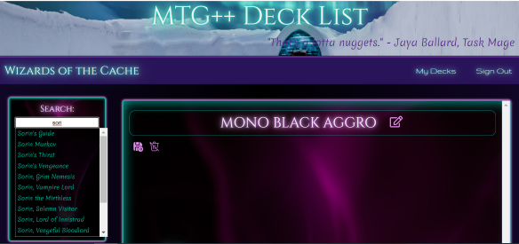

  
  # Magic: the Gathering Deck Creation Application
   

  

  ## Description: 
  Fans of *Magic: The Gathering* will delight in utilizing this application to create, manage, and showcase their card collections. Search for official cards and add them to your collection, build your decks, and plan your strategy for your next competition!
  &nbsp;
  &nbsp;

  &nbsp;
  &nbsp;
  ## Table of Contents
  - [Usage](#usage)
  - [License](#license)
  - [Contributing](#contributing)
  - [Questions](#questions)
   

  &nbsp;
  &nbsp;
  ## Usage:
  Users can create an account by clicking on the "Register" link on the homepage. Once logged in, users are redirected to a page that displays their saved decks in the order they were created. On this page, users have the option to edit, delete, or create a new deck. The edit option redirects to a page that displays the cards (if any) within the selected deck. This page features a search field with auto-complete and card preview that allows users to add new cards. Options to remove cards from the deck and rename the deck are also available.

  &nbsp;
  &nbsp;

  &nbsp;
  &nbsp;
  Screenshots:

  

  &nbsp;
  &nbsp;

  
  
  &nbsp;
  &nbsp;
  
  &nbsp;
  &nbsp;
  ## License:
      This project is licensed under the MIT license.

    
  &nbsp;
  &nbsp;

  ## Contributing:
  If you would like to contribute to this project, please use a fork to push your code to the repo and make a pull request.
  &nbsp;
  &nbsp;

  &nbsp;
  &nbsp;
  ## Questions:
  If you have questions about this project, please contact us:
   
  
  Kaileb Hammontree: [hammontreewebdev@gmail.com](mailto:hammontreewebdev@gmail.com)

  Brandon Hill: [hillbp2014@gmail.com](mailto:hillbp2014@gmail.com)

  Craig Putzstuck: [putzstuck@gmail.com](mailto:putzstuck@gmail.com)

  Jack Kane: [jkanvision@knights.ucf.edu](mailto:jkanvision@knights.ucf.edu). 
   
    &nbsp;
  &nbsp;

  You can view our other projects by visiting our individual GitHub profile pages: 
   

  Kaileb Hammontree: [https://github.com/HammontreeWebDev](https://github.com/HammontreeWebDev)

  Brandon Hill: [https://github.com/LuckySal](https://github.com/LuckySal)

  Craig Putzstuck: [https://github.com/argounova](https://github.com/argounova)

  Jack Kane: [https://github.com/jkanvision](https://github.com/jkanvision)